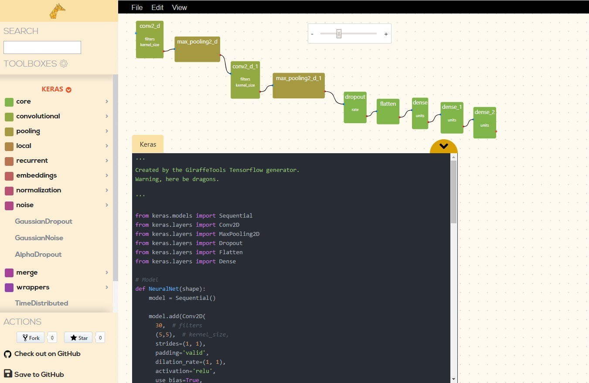
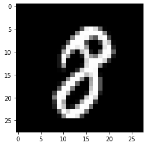
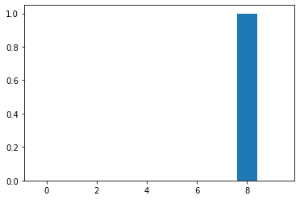

# Digit Recognition with Keras & GiraffeTools
A machine learning network for digit recognition in GiraffeTools. The neural network is visualised, modified, and saved via the link here:
https://giraffe.tools/porcupine/TimVanMourik/keras-giraffetools-digit-recognition

The business logic for loading data and feeding it to the model is included in main Python file `digit_recognition.py`.

For easy inspection, there is also a Jupyter notebook (`digit_recognition.ipynb`) that is equivalent but also shows some output here and there. Like an input image:

That is classified and decided to be an 8:

### Credits
This example is taken from a [tutorial](https://machinelearningmastery.com/handwritten-digit-recognition-using-convolutional-neural-networks-python-keras) by @jbrownlee.
Go check out his work! https://machinelearningmastery.com
